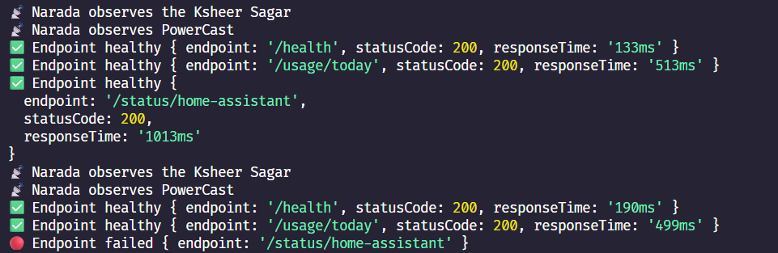

# Narada (नारद)

> Messenger of the Homelab

Narada is an event-driven monitoring and alerting system designed for homelabs and self-hosted infrastructure.

Inspired by Narada — the divine messenger from Hindu mythology — this project acts as the communication layer between services, infrastructure, failures and notifications.



---

## Quick Start

### Prerequisites

- [Node.js](https://nodejs.org/) 20+ (LTS recommended)
- A running [PowerCast](https://github.com/vipulism/powerCast) instance (or compatible API base URL)
- Telegram bot token and chat ID

### 1. Clone and configure

```bash
git clone https://github.com/vipulism/narada.git
cd narada
cp .env.example .env
```

Edit `.env`:

| Variable | Description |
|----------|-------------|
| `POWERCAST_BASE_URL` | PowerCast API base URL (no trailing slash), e.g. `http://localhost:3000` |
| `TELEGRAM_BOT_TOKEN` | From [@BotFather](https://t.me/BotFather) |
| `TELEGRAM_CHAT_ID` | Your Telegram chat ID |
| `SLOW_THRESHOLD_MS` | Optional; default `2000` — marks endpoint as slow above this latency |

### 2. Run locally

```bash
npm install
npm run dev
```

You should see logs every minute:

```text
📡 Narada is observing the Ksheer Sagar
📡 Narada observes the Ksheer Sagar
📡 Narada observes PowerCast
```

Narada polls PowerCast every **1 minute** and sends Telegram alerts on failure, slowness, or recovery.

### 3. Run with Docker (recommended for homelab)

```bash
cp .env.example .env
# edit .env with your values

docker compose up -d --build
docker compose logs -f narada
```

Stop:

```bash
docker compose down
```

If PowerCast runs on your host machine (not in this compose stack), set:

```env
POWERCAST_BASE_URL=http://host.docker.internal:3000
```

### Production build (without Docker)

```bash
npm run build
npm start
```

---

## What Narada monitors (today)

PowerCast endpoints (via `POWERCAST_BASE_URL`):

- `/health`
- `/status/home-assistant`
- `/usage/today`

States: **healthy** · **slow** (over threshold) · **failed** — with Telegram notifications on state changes.

---

## Features

- PowerCast API uptime and latency monitoring
- Telegram notifications (failure, slow, recovery)
- Per-endpoint state tracking and deduplicated alerts
- Configurable slow-response threshold
- Lightweight Node.js + TypeScript architecture
- Docker deployment via Compose

---

## Planned Features

- Docker container health monitoring
- Backup failure detection
- RabbitMQ integration
- Redis support
- Web dashboard
- Prometheus metrics
- Distributed multi-node monitoring
- Event history & logs
- AI-assisted diagnostics
- Auto-remediation workflows

---

## Philosophy

```text
Mandara churns the ocean.
Narada carries the message.
Halahal warns of failure.
Amrit represents stable infrastructure.
```
